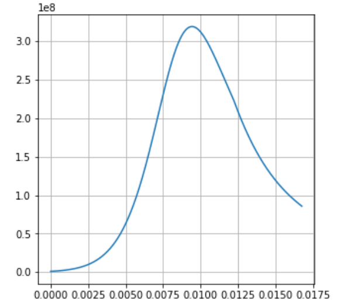

# PyBallistics
Python-библиотека для решения ОЗВБ в термодинамической и газодинамической постановках. 

## Установка
Установить библиотеку можно через менеджер пакетов [pip](https://ru.wikipedia.org/wiki/Pip_(%D0%BC%D0%B5%D0%BD%D0%B5%D0%B4%D0%B6%D0%B5%D1%80_%D0%BF%D0%B0%D0%BA%D0%B5%D1%82%D0%BE%D0%B2)). Для этого достаточно выполнить в консоли команду

```
pip install pyballistics
```

## Краткая инструкция по использованию

Пример расчета ОЗВБ в термодинамической постановке задачи AGARD:

```python
from pyballistics import ozvb_termo, get_options_agard

opts = get_options_agard() # получить словарь с начальными данными задачи AGARD
result = ozvb_termo(opts)  # произвести расчет и получить резульат
```
Переменная ```result``` является [словарем](https://pythonworld.ru/tipy-dannyx-v-python/slovari-dict-funkcii-i-metody-slovarej.html), в котором находятся результаты расчета.
Для визуализации части результатов можно воспользоваться следующим кодом:

```python
import matplotlib.pyplot as plt # если нет библиотеки matplotlib, то установить ее можно при помощи команды pip install matplotlib

plt.plot(result['t'], result['p_m']) # среднебаллистическое давление от времени
plt.grid()  # сетка на графике
plt.show()  # показать график
```

В результате будет получен следующий график зависимости среднебаллистического давления (Па) от времени (с):


В словаре ```result``` есть все необходимые данные для дальнейшего анализа:

```python
import numpy as np 

# максимальное давление
print(np.max(result['p_m']))
>>> 319103989.57

# дульная скорость
print(result['v_p'][-1])
>>> 671.16

# доля сгоревшего пороха
print(result['psi_1'][-1])
>>> 0.932
```

## Более подробная инструкция

За сами расчеты ОЗВБ отвечают две функции: ```ozvb_termo``` и ```ozvb_lagrange```. Они могут быть импортированы непосредственно из библиотеки:

```python
from pyballistics import ozvb_termo, ozvb_lagrange
```
Функция ```ozvb_termo``` производит термодинамический расчет, а ```ozvb_lagrange``` - газодинамический в Лагранжевых координатах. 

Обе эти функции на вход принимают словари, в которых хранятся все необходимые для расчета начальные данные. Примеры таких словарей можно получить из функций ```get_options_agard``` и ```get_options_sample```:

```python
from pyballistics import get_options_agard, get_options_sample

opts1 = get_options_agard()
opts2 = get_options_sample()

print(opts2)
# {
#   'powders': [
#       {'omega': 7, 'dbname': 'ДГ-4 15/1'},
#       {'omega': 6, 'dbname': '22/7'}],
#  'init_conditions': {
#       'q': 51.76,
#       'd': 0.122,
#       'W_0': 0.0325,
#       'phi_1': 1.02,
#       'p_0': 30000000.0 },
#  'igniter': {
#       'p_ign_0': 1000000.0},
#  'meta_termo': {
#       'dt': 5e-06, 
#       'method': 'rk2'},
#  'meta_lagrange': {
#       'CFL': 0.9, 
#       'n_cells': 150},
#  'stop_conditions': {
#       'v_p': 690, 
#       'p_max': 600000000.0, 
#       'x_p': 9}
# }
```
Словарь со входными данными является иерархической структурой данных (словарь словарей, списков и т.д.). Для указания всех данных, однозначно описывающих задачу ОЗВБ, словарь должен быть довольно громоздким и неудобным для формирования. Для упрощения формирования своваря многие входящие в него элементы имеют значения по-умолчанию и их, в случае необходимости, можно не указывать. Однако есть ряд элементов и значений, которые указывать обязательно. 
Словарь со входными данными состоит из следующих элементов "верхнего уровня":
 - ```'init_conditions'``` - **обязательный раздел**. В данном разделе хранится словарь с начальными данными:
   - ```'q'``` - масса снаряда в кг;
   - ```'d'``` - калибр, м;
   - ```'W_0'``` - начальный объем каморы, м^3;
   - ```'phi_1'``` - коэффициент, учитывающий силу трения в нарезах (участвует в вормуле расчета коэффициента фиктивности массы снаряда);
   - ```'p_0'``` - давление форсирования, Па;
   - ```'T_0'```(*опционально*) - начлаьная температура, К (*значение по-умолчанию 293.15 К*);
   - ```'S'```(*опционально*) - площадь поперечного сечения, м^2. (*значение по-умолчанию pi d^2 / 4*);
    

 - ```'powders'``` - **обязательный раздел**. В данном разделе хранится [список](https://pythonworld.ru/tipy-dannyx-v-python/spiski-list-funkcii-i-metody-spiskov.html) с данными по пороховым навескам, из которых состоит метательный заряд. **Обязательно должен иметь хотя бы один эелемент**. Каждый элемент списка отвечает за свою навеску и тоже является словарем со следующими элементами:
   - ```'omega'``` - масса навески заряда, кг;
   - ```'dbname'```(*опционально*) - имя пороха в БД. **Если указать, то для остальных элементов будут определены значения по-умолчанию. Если не указать, то все остальные элементы будет необходимо инициализировать** (cписок доступных имен можно получить из функции ```get_powder_names```). Т.е. при желании можно корректировать часть характреистик табличных порохов и брать у них остальные значения стандартными.
   - ```'I_e'```(*опционально, если указан ```'dbname'```*) - импульс конца горения, Па с.
   - ```'nu'``` (*опционально, если указан ```'dbname'```*) - показатель в степенном законе горения (*по-умолчанию 1*).
   - ```'b'```(*опционально, если указан ```'dbname'```*) - коволюм пороховых газов, м^3/кг.
   - ```'delta'```(*опционально, если указан ```'dbname'```*) - плотность пороха, кг/м^3.
   - ```'f'```(*опционально, если указан ```'dbname'```*) - сила пороха, Дж/кг.
   - ```'k'```(*опционально, если указан ```'dbname'```*) - оэффициент адиабаты пороховых газов.
   - ```'T_c'```(*опционально, если указан ```'dbname'```*) - темп. горения пороха, К.
   - ```'z_e'```(*опционально, если указан ```'dbname'```*) - относительная толщина сгоревшего слоя конца горения.
   - ```'kappa_1'```(*опционально, если указан ```'dbname'```*) - коэффициент в геометрическом законе горения.
   - ```'lambda_1'```(*опционально, если указан ```'dbname'```*) - коэффициент в геометрическом законе горения.
   - ```'mu_1'```(*опционально, если указан ```'dbname'```*) - коэффициент в геометрическом законе горения.
   - ```'kappa_2'```(*опционально, если указан ```'dbname'```*) - коэффициент в геометрическом законе горения.
   - ```'lambda_2'```(*опционально, если указан ```'dbname'```*) - коэффициент в геометрическом законе горения.
   - ```'mu_2'```(*опционально, если указан ```'dbname'```*) - коэффициент в геометрическом законе горения.
   - ```'k_I'```(*опционально, если указан ```'dbname'```*) - коэффициент для пересчета импульса конца горения для других начальных температур, 1/K.
   - ```'k_f'```(*опционально, если указан ```'dbname'```*) - коэффициент для пересчета силы пороха для других начальных температур, 1/K.
 - ```'igniter'``` - **обязательный раздел**. В данном разделе хранится словарь с начальными данными, которые относятся к воспламенителю. Словарь имеет следующие элементы:
   - ```'p_ign_0'``` - давление вспышки, Па;
   - ```'k_ign'```(*опционально*) - коэффициент адиабаты газов воспламенителя (*значение по-умолчанию 1.22*).
   - ```'T_ign'```(*опционально*) - температура горения воспралменителя, К (*значение по-умолчанию 2427*).
   - ```'f_ign'```(*опционально*) - сила воспламенителя, Дж/кг(*значение по-умолчанию 260 000 Дж/кг*).
   - ```'b_ign'```(*опционально*) - коволюм газов воспламенителя, м^3/кг (*значение по-умолчанию 0.0006*).
 - ```'windage'``` - **опциональный раздел**. В данном разделе хранится словарь с начальными данными, которые относятся к силе сопротивления воздуха перед снарядом. Если не указывать этот элемент, то будут использованы значения по-умолчанию. Словарь имеет следующие элементы:
   - ```'shock_wave'```(*опционально*) - флаг ```True/False```, показывающий нужно ли рассчитывать давление ударной волны по формуле, или использовать просто статичное давление ```'p_0a'``` (*значение по-умолчанию ```True```*) ;
   - ```'p_0a'```(*опционально*) - давление воздуха перед снарядом, Па (*значение по-умолчанию 100 000*).
   - ```'k_air'```(*опционально*) - показатель адиабаты воздуха (*значение по-умолчанию 1.4*).
   - ```'c_0a'```(*опционально*) - скорость звука в воздухе, м/с (*значение по-умолчанию 340*).
 - ```'heat'``` - **опциональный раздел**. В данном разделе хранится словарь с начальными данными, которые относятся к теплообмену ГПС со стволом. Если не указывать этот элемент, то будут использованы все значения по-умолчанию. Словарь имеет следующие элементы:
   - ```'enabled'```(*опционально*) - флаг ```True/False```, показывающий нужно ли учитывать теплообмен со стволом (*значение по-умолчанию ```True```*).
   - ```'heat_barrel'```(*опционально*) - флаг ```True/False```, показывающий нужно ли учитывать рассчитвать динамически температуру стенки ствола, или температура стенок ствола не меняется (*значение по-умолчанию ```True```*).
   - ```'F_0'```(*опционально*) - начальная площадь теплоотдачи, м^2 (*значение по-умолчанию 4W_0/d*).
   - ```'Pr'```(*опционально*) - число Прандля (*значение по-умолчанию 0.74*).
   - ```'T_w0'```(*опционально*) - началоная температура стенки, К. Если не указывть - то будет взята начальная температура.
   - ```'mu_0'```(*опционально*) - коэффициент динамической вязкости пороховых газов для формулы Сазерленда, Па*с (*значение по-умолчанию 0.175e-4*).
   - ```'T_c'```(*опционально*) - тоже для формулы Сазерленда, К (*значение по-умолчанию 628*).
   - ```'T_0'```(*опционально*) - тоже для формулы Сазерленда, К (*значение по-умолчанию 273*).
   - ```'c_c'```(*опционально*) - теплоемкость материала ствола, Дж/(кг * град) (*значение по-умолчанию 500*).
   - ```'rho_c'```(*опционально*) - плотность маетриала ствола, кг/м^ (*значение по-умолчанию 7900*).
   - ```'lambda_c'```(*опционально*) - теплопроводность материала ствола, Вт/(м·град) (*значение по-умолчанию 40*).
   - ```'lambda'```(*опционально*) - теплопроводность пороховых газов, Вт/(м·К) (*значение по-умолчанию 0.2218*).
- ```'stop_conditions'``` - **обязательный раздел**. В данном разделе хранится словарь с начальными данными, которые относятся к условиям конца расчета. **Должен иметь хотя бы один элемент** (любой из нижеперечисленных). Если указано несколько условий, то расчет будет остановлен из-за условия, которое сработало раньше всего. Словарь имеет следующие элементы:
   - ```'t_max'```(*опционально*) - с, прервать расчет при t > t_max.
   - ```'steps_max'```(*опционально*) - сделать максимум  steps_max шагов интегрирвоания.
   - ```'v_p'```(*опционально*) - м/с, прервать расчет, когда скорость снаряда достигнет v_p.
   - ```'x_p'```(*опционально*) - м, прервать расчет, когда снаряд пройдет x_p метров (в начальный момент снаряд прошел 0 м).
   - ```'p_max'```(*опционально*) - Па, прервать расчет, если давление превысит p_max.
- ```'meta_termo'``` - **обязательный раздел для термодинамического расчета**. В данном разделе хранится словарь с начальными данными, которые относятся к мета-параметрам термодинамического расчета. Словарь имеет следующие элементы:
   - ```'dt'``` - с, шаг по времени.
   - ```'method'```(*опционально*) - метод интегрирования. Возможные варианты: Эйлер - 'euler'; Рунге-Кутты 2 порядка -'rk2'; -  Рунге-Кутты 4 порядка - 'rk4' (*значение по-умолчанию 'rk2'*).
- ```'meta_lagrange'``` - **обязательный раздел для газодинамического расчета**. В данном разделе хранится словарь с начальными данными, которые относятся к мета-параметрам газодинамического расчета. Словарь имеет следующие элементы:
   - ```'n_cells'``` - количество ячеек сетки.
   - ```'CFL'``` - число Куранта (0 < CFL < 1).
   - ```'W'```(*опционально*) - lополнительное требование для повышения устойчивости: последующий шаг по времени не может быть больше текущего в W раз.

## Структура результатов термодинамической модели

В зависимости от результатов расчета, словарь может быть двух видов. Если в результате расчета произошла ошибка, то будет сформирован следующий словарь:

```python
{
    'stop_reason': 'error',   # показывает, что в процессе расчета произошла ошибка
    'error_message': '...',   # описание ошибки
    'exception': Error('...'),# ссылка на саму ошибку (ее можно вызвать при помощи raise для трассировки) 
    'execution_time': float   # время выполнения функции в секундках
}
```

Пример:

```python 
result = ozvb_termo({})  # передаем пустой словарь
print(result)
>>> {
    'stop_reason': 'error',
    'error_message': 'В словаре opts обязательно должно быть поле "powders", в котором указываются параметры заряда. Пример правильного словаря opts можно получить из функции get_termo_options_sample()',
    'exception': ValueError('В словаре opts обязательно должно быть поле "powders", в котором указываются параметры заряда. Пример правильного словаря opts можно получить из функции get_termo_options_sample()'),
    'execution_time': 1.7400000047018693e-05
}
```

Если расчет прошел без ошибок, то словарь с результатами будет следующий:

```python
{
    't': np.array([...]),     # numpy-массив с точками по времени в секундах, в которых были рассчитаны остальные значения 
    'p_m': np.array([...]),   # numpy-массив со среднебаллистическим давлением в Па
    'T': np.array([...]),     # numpy-массив с темперетурой ГПС в Кельвинах
    'x_p':np.array([...]),    # numpy-массив с положением снаряда в метрах (в начальный момент x_p==0)
    'v_p': np.array([...]),   # numpy-массив со скоростью снаряда в м/c (в начальный момент v_p==0)
    'Q_pa': np.array([...]),  # numpy-массив с суммарной энергией в Дж, потраченной на преодоление сил сопротивления атмосфеному давлению перед снарядом
    'Q_w': np.array([...]),   # numpy-массив с суммарной энергией в Дж, отданой ГПС на нагрев ствола
    'W_p': np.array([...]),   # numpy-массив с заснарядным объемом в м^3
    'W_c': np.array([...]),   # numpy-массив с объемом в м^3, занятым коволюмом ГПС и конденсированной фазой ГПС
    'T_w': np.array([...]),   # numpy-массив со средней температурой ствола в К
    'k': np.array([...]),     # numpy-массив с показателями адиабаты ГПС
    'z_1': np.array([...]),   # numpy-массив с относительной толщиной сгоревшего свода пороха навески №1
    'psi_1': np.array([...]), # numpy-массив с относительной массой сгоревшего пороха навески №1
    'z_2': np.array([...]),   # numpy-массив с относительной толщиной сгоревшего свода пороха навески №2
    'psi_2': np.array([...]), # numpy-массив с относительной массой сгоревшего пороха навески №2
        ...                   # и так N раз
    'stop_reason': str,       # причина остановки расчета ('t_max', 'steps_max', 'v_p', 'x_p', 'p_max')
    'execution_time': float   # время, потраченное на расчет, в секундках
}
```
Пример:
```python

opts = get_options_sample()
result = ozvb_termo(opts)
print(result)
>>> {
    't':    array([0.   , 0.   , ..., 0.027, 0.027]),
    'p_m':  array([ 1000000.   ,  1002189.433, ..., 90680294.893, 90629603.46 ]),
    'T':    array([2427.   , 2427.487, ..., 1824.249, 1823.988]),
    'x_p':  array([0.   , 0.   , ..., 6.394, 6.398]),
    'v_p':  array([  0.   ,   0.   , ..., 689.994, 690.085]),
    'Q_pa': array([    0.   ,     0.   , ..., 45159.509, 45195.554]),
    'Q_w':  array([      0.   ,       0.   , ..., 3447622.549, 3449318.738]),
    'W_p':  array([0.033, 0.033, ..., 0.107, 0.107]),
    'W_c':  array([0.008, 0.008, ..., 0.014, 0.014]),
    'T_w':  array([293.15 , 293.15 , ..., 315.661, 315.661]),
    'k':    array([1.22 , 1.22 , ..., 1.238, 1.238]),
    'z_1':  array([0.   , 0.   , ..., 0.954, 0.954]),
    'psi_1':array([0.   , 0.   , ..., 0.954, 0.954]),
    'z_2':  array([0.   , 0.   , ..., 1.343, 1.343]),
    'psi_2':array([0.   , 0.   , ..., 0.987, 0.987]),
    'stop_reason': 'v_p',
    'execution_time': 0.21484209999971426
}
```

## Структура результатов газодинамической модели


В зависимости от результатов расчета, словарь может быть двух видов. Если в результате расчета произошла ошибка, то будет сформирован следующий словарь:

```python
{
    'stop_reason': 'error',   # показывает, что в процессе расчета произошла ошибка
    'error_message': '...',   # описание ошибки
    'exception': Error('...'),# ссылка на саму ошибку (ее можно вызвать при помощи raise для трассировки) 
    'execution_time': float   # время выполнения функции в секундках
}
```

Пример:

```python
result = ozvb_lagrange({})  # передаем пустой словарь
print(result)
>>> {
    'stop_reason': 'error',
    'error_message': 'В словаре opts обязательно должно быть поле "powders", в котором указываются параметры заряда. Пример правильного словаря opts можно получить из функции get_termo_options_sample()',
    'exception': ValueError('В словаре opts обязательно должно быть поле "powders", в котором указываются параметры заряда. Пример правильного словаря opts можно получить из функции get_termo_options_sample()'),
    'execution_time': 1.7400000047018693e-05
}
```


Если расчет прошел без ошибок, то словарь с результатами будет следующий:

```python
{
    'stop_reason': str,     # причина остановки расчета ('t_max', 'steps_max', 'v_p', 'x_p', 'p_max')
    'execution time': float,# время выполнения расчета в секундках
    'layers': [             # список со словарями. В каждом словаре хранятся данные одного временного слоя
        {                       # Словарь первого временного слоя. Слой состоит из N ячеек
            't': 0.0,               # время временного слоя в секундах
            'step_count': 0,         # номер шага по времени
            'x': np.array([...]),    # numpy-массив координатами по длине узлов сетки в метрах, длина массива N+1
            'u': np.array([...]),    # numpy-массив со скоростями узлов сетки в м/с, длина массива N+1
            'T': np.array([...]),    # numpy-массив с температурами ГПС в ячейках в Кельвинах. Длина массива N
            'rho': np.array([...]),  # numpy-массив с плотностями ГПС в ячейках в кг/м^3. Длина массива N
            'p': np.array([...]),    # numpy-массив с давлениями ГПС в ячейках в Па. Длина массива N
            'T_w':np.array([...]),   # numpy-массив с температурами стенок ствола в ячейках в Кельвинах. Длина массива N
            'k':  np.array([...]),   # numpy-массив с показателями адиабаты ГПС в ячейках. Длина массива N
            'z_1': np.array([...]),  # numpy-массив с относительными толщинами сгоревшего свода пороха навески №1 по ячейкам. Длина массива N 
            'psi_1': np.array([...]),# numpy-массив с относительными массами сгоревшего пороха навески №1 по ячейкам. Длина массива N 
            'z_2':np.array([...]),   # numpy-массив с относительными толщинами сгоревшего свода пороха навески №2 по ячейкам. Длина массива N 
            'psi_2': np.array([...]),# numpy-массив с относительными массами сгоревшего пороха навески №2 по ячейкам. Длина массива N 
            ... # и так до 'z_N', 'psi_N'
        },
        {...},                 # Словарь второго временного слоя. Слой состоит из N ячеек
        {...},                 # Словарь третьего временного слоя. Слой состоит из N ячеек
        ...,                   № и т.д.
    ]     # конец списка 'layers'
}
```

Пример:

```
opts = get_options_sample()
result = ozvb_lagrange(opts)
print(result)
>>> {
    'stop_reason': 'v_p',
    'execution time': 0.167843300000186, 
    'layers': [
        {
            't': 0.0,
            'step_count': 0,
            'x': array([-2.78 , -2.762, ..., -0.019,  0.   ]),
            'u': array([0., 0., ..., 0., 0.]),
            'T': array([2427., 2427., ..., 2427., 2427.]),
            'rho': array([402.851, 402.851, ..., 402.851, 402.851]),
            'p': array([1000000., 1000000., ..., 1000000., 1000000.]),
            'T_w': array([293.15, 293.15, ..., 293.15, 293.15]),
            'k': array([1.22, 1.22, ..., 1.22, 1.22]),
            'z_1': array([0., 0., ..., 0., 0.]),
            'psi_1': array([0., 0., ..., 0., 0.]),
            'z_2': array([0., 0., ..., 0., 0.]),
            'psi_2': array([0., 0., ..., 0., 0.])
        },
        {
            't': 0.00026096741712768897,
            'step_count': 1,
            'x': array([-2.78 , -2.762, ..., -0.019,  0.   ]),
            'u': array([0., 0., ..., 0., 0.]),
            'T': array([2450.216, 2450.216, ..., 2450.216, 2450.216]),
            'rho': array([402.851, 402.851, ..., 402.851, 402.851]),
            'p': array([1114231.986, 1114231.986, ..., 1114231.986, 1114231.986]),
            'T_w': array([293.15, 293.15, ..., 293.15, 293.15]),
            'k': array([1.222, 1.222, ..., 1.222, 1.222]),
            'z_1': array([0., 0., ..., 0., 0.]),
            'psi_1': array([0., 0., ..., 0., 0.]),
            'z_2': array([0., 0., ..., 0., 0.]),
            'psi_2': array([0., 0., ..., 0., 0.])
        },
        ...
    ]
}
```

## Дополнительные функции

В библиотеке также есть несколько дополнительных функций, описание к которым есть в их [документации](https://devman.org/qna/13/chto-takoe-docstring-s-chem-ego-edjat/):

```python
from pyballistics import get_full_options, get_db_powder, get_powder_names

print(get_full_options.__doc__)
print(get_db_powder.__doc__)
print(get_powder_names.__doc__)
```